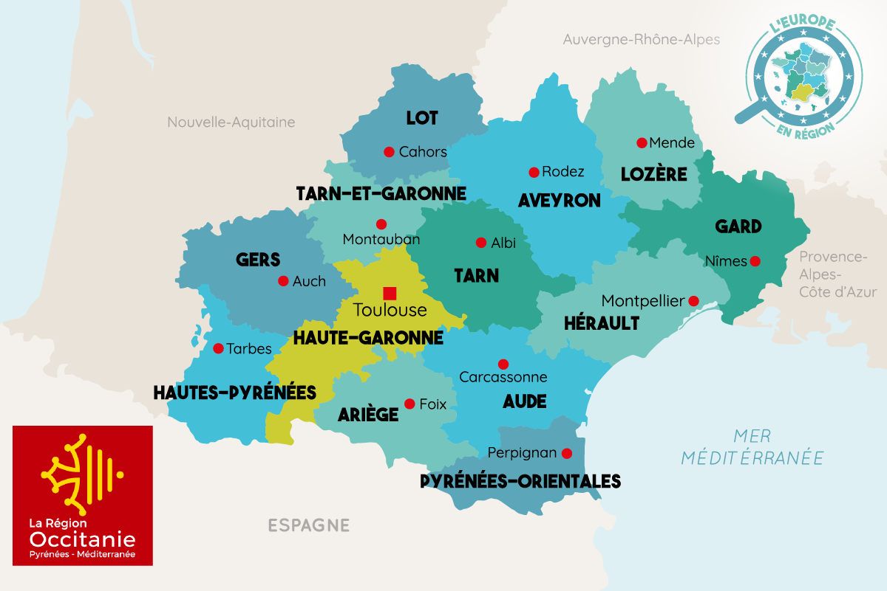
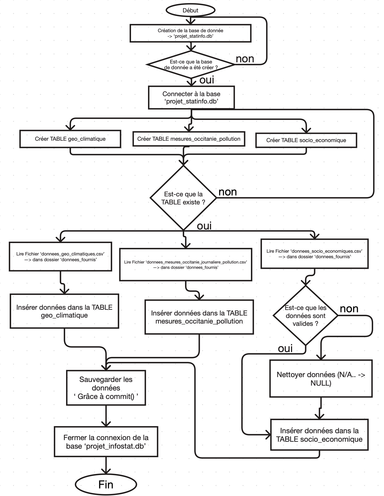

# Projet Pollution Occitanie
## Carte de la région étudiée

## Contexte

Ce projet a été réalisé dans le cadre d'un travail universitaire portant sur l'analyse de la pollution atmosphérique en région Occitanie.

L'objectif est d'étudier les liens entre :

* les données climatiques ;
* les données socio-économiques ;
* les mesures de pollution ;
* l'évolution de la population.
## Diagramme d'activité

## Technologies utilisées

* Python
* Csv
* Rmarkdown
* SQLite
* SQL
* HTML / PHP

## Structure du projet

* `BD/` : base de données et scripts de création des tables
* `donnees_fournis/` : jeux de données utilisés
* `problematique1/` : analyses exploratoires
* `problematique2/` : étude des facteurs climatiques
* `problematique3/` : évolution de la pollution et de la population
* `rapport/` : rapport final et visualisations

## Résultats

Le projet met en évidence plusieurs corrélations entre les indicateurs climatiques et les niveaux de pollution observés dans différentes communes d'Occitanie.

## 📄 Rapport final

-> Le rapport complet du projet est disponible ici :
**[Consulter le rapport interactif](rapport/rapport_final.html)**

## Auteurs

AYEDI Zouaouia
Étudiante en MIASHS parcours Mathématique-SHS

BEN JEDDOU Souha
Étudiante en MIASHS parcours Informatique-SHS

BELATAR Ikram
Étudiante en MIASHS parcours Mathématique-SHS

GHEDHOUI Dourra
Étudiante en MIASHS parcours Mathématique-SHS
